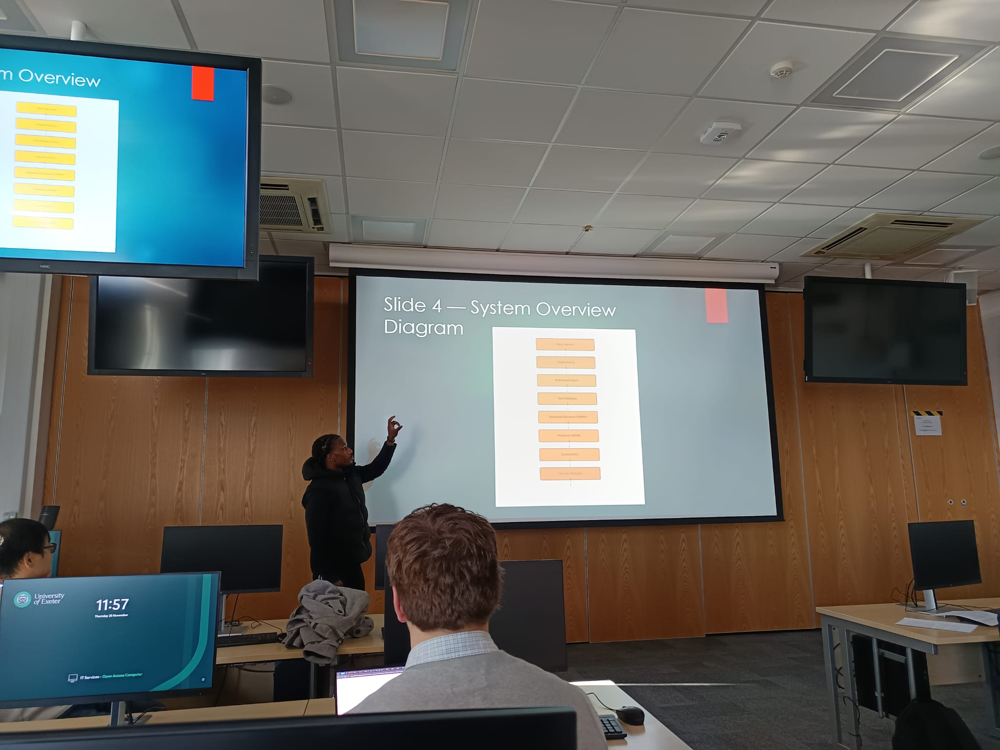

# 📘 HCAI-Triage  
*A Human-Centred AI System for Remote Primary Care & Early Warning*

## 🧠 Project Overview
HCAI-Triage is a Human-Centred AI system designed to support remote health assessment, early-warning detection, and clinician-involved triage. It integrates multimodal data, probabilistic reasoning, sequential decision-making, preference-sensitive recommendations, and explainable AI.

---

## 📄 Full Coursework Report  
Click below to open the full 5,000-word report:

➡️ **[HCAI.pdf](./report/HCAI.pdf)**

---

## 📸 Presentation Photo  
Here is an image of me presenting Slide 4 — *System Overview Diagram* — during the workshop:

---

## 🏗️ System Architecture (Summary)

HCAI-Triage contains eight key modules:

1. **Data Ingestion & Governance**  
2. **Preprocessing & Feature Extraction**  
3. **Multimodal Behaviour Understanding & Fusion**  
4. **Risk Prediction (GBDT / Temporal DL + Bayesian Updating)**  
5. **Sequential Decision-Making (POMDP-inspired)**  
6. **Patient Preferences & MCDM (TOPSIS)**  
7. **Explainability & Generative Interface**  
8. **Clinician-in-the-Loop Oversight**

---

## 🎯 Key Features

- 🔀 Multimodal input fusion  
- 📊 Uncertainty-aware risk modelling  
- 🔁 Sequential decision policies  
- 🧍‍♂️ Patient-centred recommendations  
- 🔎 Transparent LLM-generated explanations  
- 🩺 Clinician supervision & safe fallback pathways  

---

## 🎓 Coursework Context  
Created for **COMM111 – Foundations of Human-Centred AI (2025/26)**.  
Demonstrates skills across:

- Human-AI interaction  
- Responsible & explainable AI  
- Bayesian reasoning  
- Sequential decision models  
- Multicriteria decision-making  
- Ethical system design  

---

## 📬 Contact  
**Author:** Oluwaseyi Bello**  
MSc Human-Centred Artificial Intelligence with Proficiency in Data Science  
University of Exeter  

